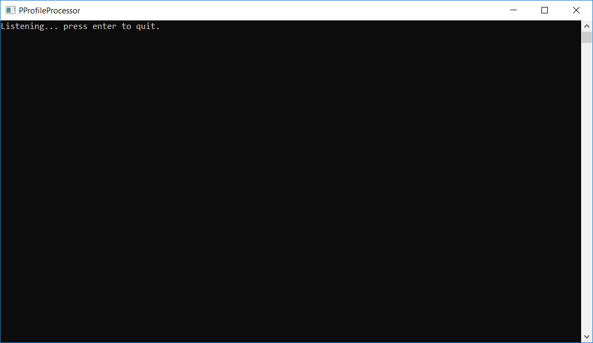
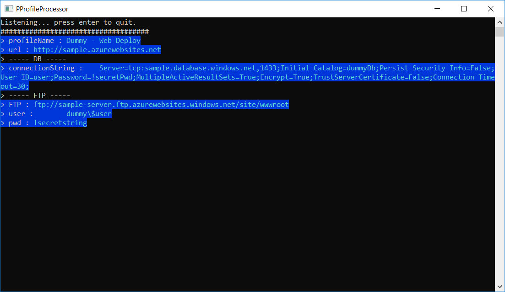

# Provision Profile Processor
## Easy way to read FTP credentials and SQL connection string

*This is training project just to train work with files, and make it easier to download credentials from Azure public profiles.*
---

### Guide

1. Run program, listener will be activated
   

2. Go to azure portal and click **Get publish profile**
3. Download file to your **/user/Downloads** folder
4. When publish profile will be downloaded you will see result
   

5. Copy credentials you need
6. Downladed profile will be archived in **/user/Downloads/00_PublishProfiles** directory
7. Type **Enter** to quit program
